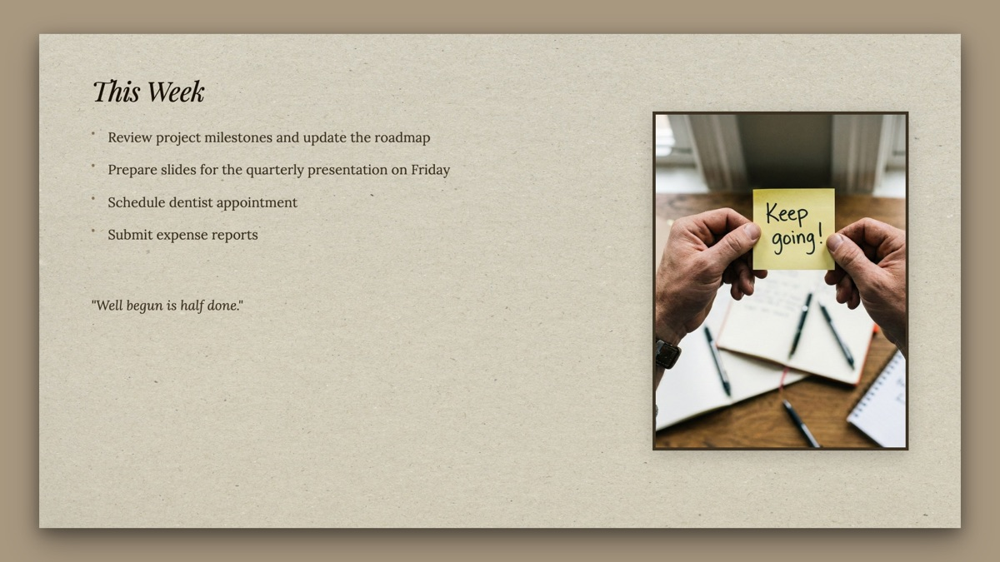
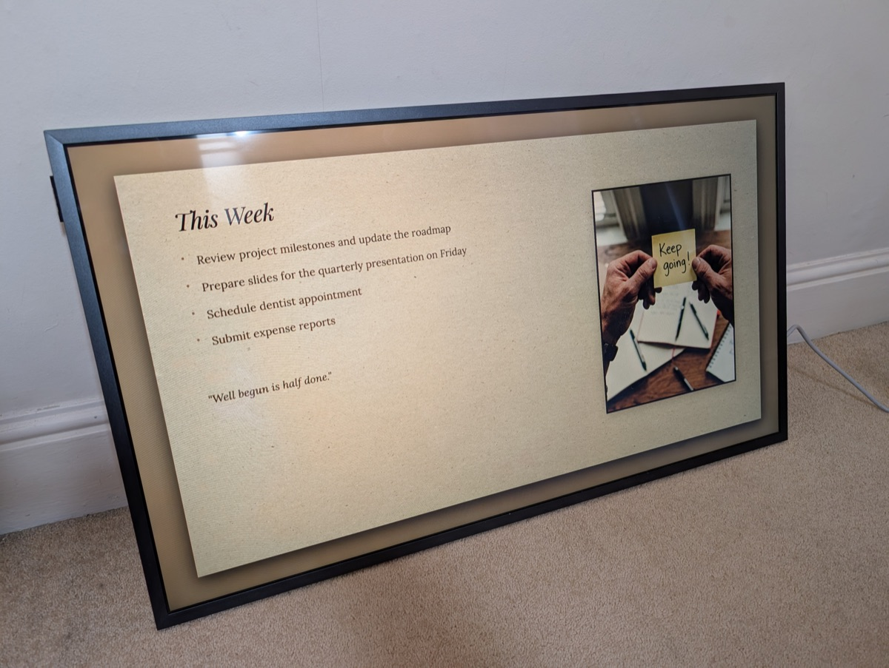

# frame-automation

Display markdown content on a Samsung Frame TV in Art Mode. Note that I've only tested this on an old Frame, I believe this won't work with newer models.

Reads a markdown file, renders it to a styled 1920×1080 image (I have a 32" Frame), and uploads it via [samsungtvws](https://github.com/xchwarze/samsung-tv-ws-api).

<p align="center">
  
</p>

<p align="center">
  
</p>

## Requirements

- Samsung Frame TV (not all versions will work, tested on 2022 QE32LS03TC)
- Python 3.13+

## Setup

```bash
git clone git@github.com:tavva/frame-automation.git
cd frame-automation
uv sync --extra render
uv run playwright install chromium
```

The `render` extra pulls in markdown and Playwright. Without it only
`frame-image` and the power control commands work; `uv sync` on its own is
enough for those.

## Usage

```bash
export FRAME_TV_IP=192.168.1.x
export FRAME_CONTENT_FILE=/path/to/content.md
export FRAME_THEME=clean  # optional, see below

uv run frame-update
```

To keep watching the configured file, run:

```bash
uv run frame-watch
```

`frame-watch` checks the file once per second and publishes it after changes
have stopped for 10 seconds. It records the last successful content digest in
`~/.frame-automation/last_content_sha256`, avoids duplicate uploads after a
restart, and retries failed updates after five minutes.

This repository includes
`launchd/net.ben-phillips.frame-goals-watch.plist`, a per-user macOS
LaunchAgent configured for `/Users/ben/Documents/Main/Display goals.md` through
the repository's `.envrc`.

### Sending an existing image

```bash
export FRAME_TV_IP=192.168.1.x

uv run frame-image /path/to/image.png
```

Uploads a PNG as-is, skipping the markdown render, so it needs no `render`
extra. The image should be 1920x1080. It replaces the previously uploaded
image just as `frame-update` does.

### Power control

```bash
export FRAME_TV_IP=192.168.1.x
export FRAME_TV_MAC=aa:bb:cc:dd:ee:ff  # optional, enables Wake-on-LAN

uv run frame-art  # switch to art mode, waking the TV first if MAC is set
uv run frame-off  # turn the TV off
```

## Themes

Themes live in the `themes/` directory. A theme is either:

- A single CSS file: `themes/clean.css`
- A folder with assets: `themes/paper/theme.css` + `themes/paper/background.jpg`

Built-in themes:

- **clean** - sage background, oversized type, numbered items (the default)
- **dark** - dark background, light text
- **paper** - paper texture with shadow border
- **paper-bleed** - paper texture, full screen (no border)
- **split** - content left, photo right, with shadow border
- **split-bleed** - content left, photo right, full screen

The split themes display a photo on the right side. Place your photo at `themes/split/user-provided/photo.jpg`.

The **clean** theme numbers each `###` heading `01`, `02`, ... and lays its
list items out as sub-items. Put the date in an `h2` to have it sit at the top
right, opposite the title:

```markdown
# Goals
## August 31 2026

### First goal
- A sub-goal
```

A single `# Goals - August 31 2026` also works; the whole line then runs along
the left of the rule.

Goals shrink to fit the frame as you add more of them, down to a quarter of
their designed size. The header and the rules stay put.

To create a custom theme, add a CSS file or folder to `themes/`. The CSS has full control over styling. Use `url(filename.jpg)` for assets relative to the theme folder.

## Content

The content file is standard markdown:

```markdown
# This Week

- First item
- Second item
- Third item
```

## License

MIT
